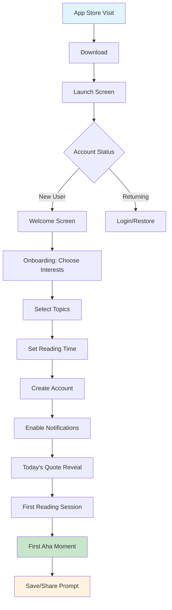
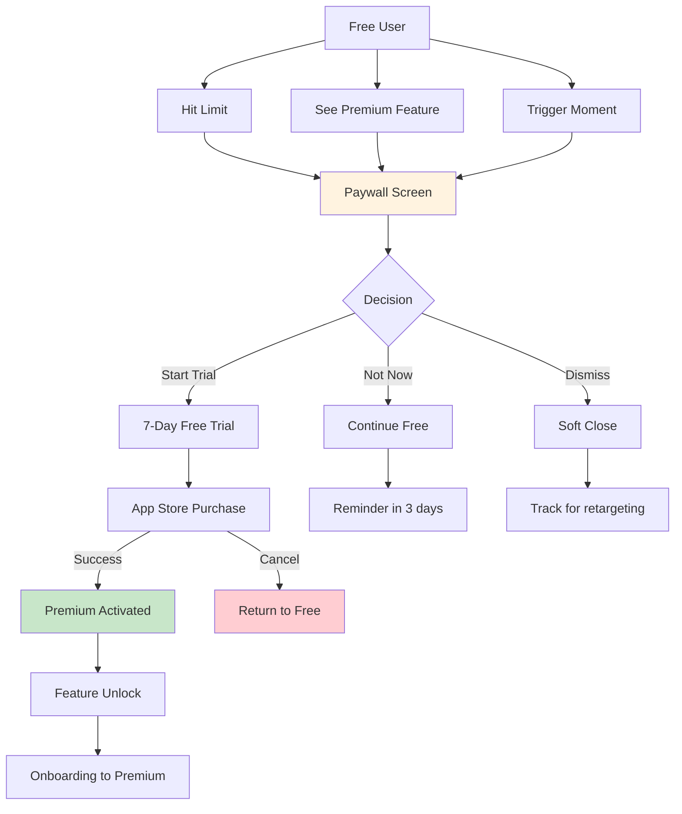
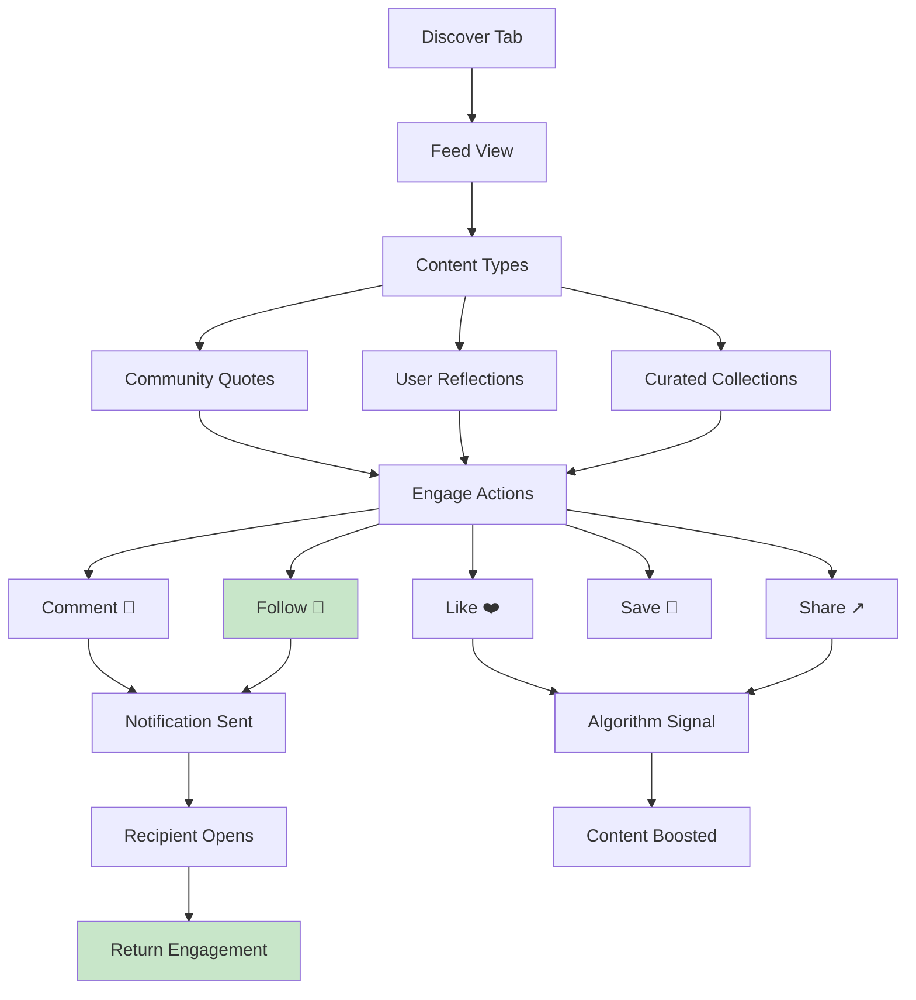
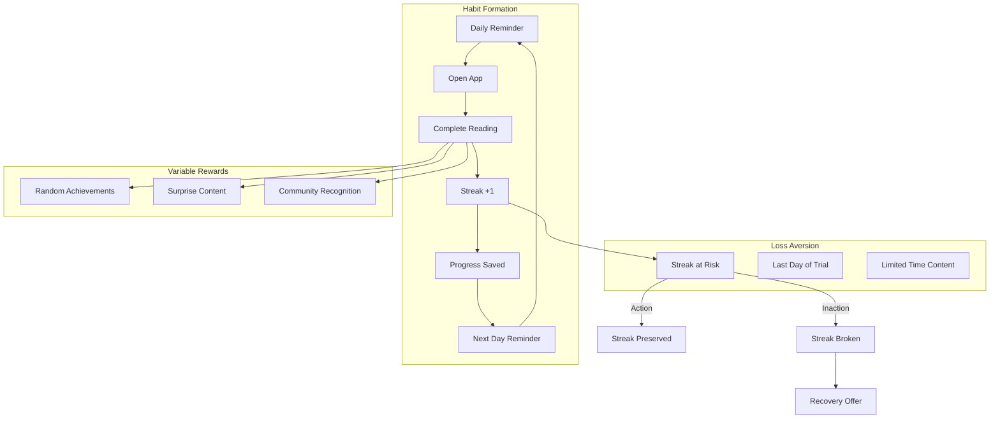
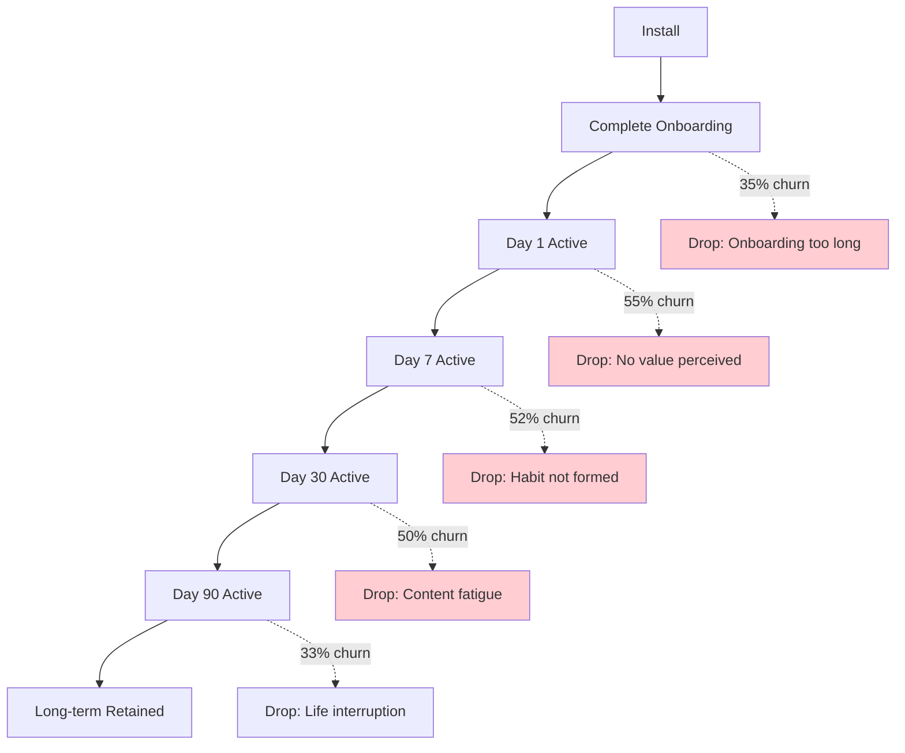
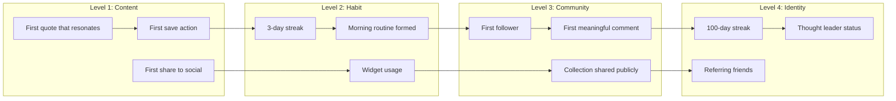

# QodeX iOS App - Complete User Journey Map

> **Reference Style:** Journey mapping inspired by Julie Zhuo (former Facebook VP Product) and the user flow patterns from Headspace, Duolingo, and Stoic apps.

---

## 📱 App Overview

**QodeX** is a daily wisdom and quotes app that delivers curated philosophical insights, book excerpts, and motivational content with a social community layer. Users read daily passages, save favorites, share reflections, and build reading streaks.

**Core Value Proposition:** *"One insight a day to level up your thinking"*

---

## 1. First-Time User Flow (Onboarding → First Value)

### User Journey Map



### Detailed Steps

| Step | Screen | Purpose | Drop-off Risk |
|------|--------|---------|---------------|
| 1 | App Store Page | Convert to download | 60% don't download |
| 2 | Launch Screen | Brand recognition | 5% |
| 3 | Welcome Carousel | Value proposition | 15% skip |
| 4 | Interest Selection | Personalization | **25%** (first friction) |
| 5 | Topic Preferences | Content relevance | 10% |
| 6 | Reading Time Setup | Habit formation | 15% |
| 7 | Account Creation | **HARD GATE** | **35% drop** |
| 8 | Notification Permission | Retention setup | 40% deny |
| 9 | First Content Reveal | Aha moment delivery | 5% |
| 10 | Reading Completion | Value realization | 10% |

### 🎯 First Aha Moment Triggers

1. **The Reveal** (3-5 seconds): Beautiful typography + animated quote appearance
2. **The Insight** (30 sec): First reflection that resonates personally
3. **The Save** (1 min): User bookmarks first quote - ownership moment
4. **The Share** (2 min): User shares to social - evangelism moment

### ⚠️ Critical Drop-off Points (Onboarding)

| Point | Drop-off % | Solution |
|-------|-----------|----------|
| Account creation gate | 35% | Offer **skip for now** - let users experience value first |
| Notification permission | 40% deny | Delay until after first save/share |
| Interest selection fatigue | 25% | Reduce from 10 to 3 taps |
| Long onboarding (>2 min) | 30% | Progressive profiling - collect later |

### 💡 Optimization Opportunities

- **Deferred Registration:** Allow reading 3 quotes before requiring signup
- **Social Proof:** "Join 2M+ daily readers" on welcome screen
- **Progress Bar:** Show "3 of 4 steps" to reduce abandonment
- **Smart Defaults:** Pre-select popular topics based on App Store category

---

## 2. Daily Active User Flow (Open → Daily Reading → Exit)

### Core Loop Diagram

```mermaid
flowchart LR
    A[Open App] --> B{Notification Type}
    B -->|Daily Reminder| C[Streak Status]
    B -->|Community Activity| D[Feed Check]
    B -->|New Content| E[Today's Drop]
    
    C --> F[Read Today's Quote]
    D --> F
    E --> F
    
    F --> G{Engagement Level}
    G -->|Quick| H[Swipe/Save 5s]
    G -->|Standard| I[Read + Reflect 2m]
    G -->|Deep| J[Journal Entry 5m]
    
    H --> K{Exit Path}
    I --> K
    J --> K
    
    K -->|Save| L[Collection]
    K -->|Share| M[Social]
    K -->|React| N[Community]
    K -->|Close| O[App Exit]
    
    style F fill:#c8e6c9
    style J fill:#ffccbc
```



### Session Flow States

```
┌─────────────────────────────────────────────────────────────────┐
│                    DAILY SESSION STATES                         │
├─────────────────────────────────────────────────────────────────┤
│                                                                 │
│  [OPEN] ──→ [CHECK STREAK] ──→ [VIEW QUOTE] ──→ [ENGAGE]      │
│     │           │                    │             │            │
│     │           │                    │             ├── Save     │
│     │           │                    │             ├── Share    │
│     │           │                    │             ├── Comment  │
│     │           │                    │             └── Journal  │
│     │           │                    │                          │
│     │           │                    └── [EXPLORE] ←───────────┤
│     │           │                         │                     │
│     │           └── Streak at risk! ──────┴─── Browse archive   │
│     │                                                           │
│     └── [Deep Link] ──→ Specific content/action                 │
│                                                                 │
└─────────────────────────────────────────────────────────────────┘
```

### Session Duration Buckets

| Session Type | Duration | Actions | % of Users |
|--------------|----------|---------|------------|
| **Micro** | < 30s | Open, glance, close | 45% |
| **Quick** | 30s - 2m | Read, maybe save | 35% |
| **Engaged** | 2m - 5m | Read, journal, share | 15% |
| **Deep** | 5m+ | Full exploration, community | 5% |

### 🔁 Entry Points & Triggers

1. **Push Notification (60% of opens)**
   - "Your daily wisdom is ready ☀️"
   - "3-day streak! Don't break it 🔥"
   - "Someone loved your reflection 💙"

2. **Widget Tap (20% of opens)**
   - Home screen widget shows quote preview
   - Tap expands full app experience

3. **Organic Open (15% of opens)**
   - Habitual morning routine
   - Stress relief seeking

4. **Deep Link (5% of opens)**
   - Shared content from friends
   - Social media referrals

### 🚪 Exit Patterns

| Exit Point | % | Context |
|------------|---|---------|
| After reading (no action) | 40% | Content consumed, value received |
| After saving | 25% | Intent to return |
| After sharing | 15% | Evangelism completed |
| Mid-read | 12% | Interrupted or bored |
| Paywall encounter | 8% | Conversion attempt |

---

## 3. Paywall Conversion Flow (Free → Premium Triggers)

### Conversion Funnel



### Paywall Trigger Points

| Trigger | Context | Conversion Rate |
|---------|---------|-----------------|
| **Save Limit** (3 saves/day) | "Unlock unlimited collections" | 4.2% |
| **Archive Access** | "Access 10,000+ past quotes" | 3.8% |
| **Audio Feature** | "Listen to daily readings" | 5.5% |
| **Advanced Journal** | "Unlock reflection templates" | 2.9% |
| **Streak Recovery** | "Restore your 45-day streak" | 8.2% |
| **Community Boost** | "Get featured, gain followers" | 3.1% |
| **Ad Removal** | "Enjoy ad-free reading" | 6.7% |

### 💰 Pricing Strategy & Flow

```
┌─────────────────────────────────────────────────────────────┐
│                    PAYWALL OPTIONS                          │
├─────────────────────────────────────────────────────────────┤
│                                                             │
│  ┌──────────────┐  ┌──────────────┐  ┌──────────────┐     │
│  │   MONTHLY    │  │   YEARLY     │  │   LIFETIME   │     │
│  │   $4.99/mo   │  │   $29.99/yr  │  │   $79.99     │     │
│  │              │  │  ⭐ SAVE 50%  │  │              │     │
│  │  [SELECT]    │  │  [SELECT]    │  │  [SELECT]    │     │
│  └──────────────┘  └──────────────┘  └──────────────┘     │
│                                                             │
│  ┌─────────────────────────────────────────────────────┐   │
│  │  🎁 7-DAY FREE TRIAL - Cancel anytime               │   │
│  └─────────────────────────────────────────────────────┘   │
│                                                             │
│  ✓ Unlimited saves        ✓ Audio readings                │
│  ✓ Full archive access    ✓ Advanced analytics            │
│  ✓ No ads                 ✓ Priority support                │
│                                                             │
└─────────────────────────────────────────────────────────────┘
```

### 🎯 Conversion Optimization Tactics

1. **Scarcity/Urgency**
   - "50% off - Ends tonight"
   - "Only 3 streak recoveries left"

2. **Social Proof**
   - "Join 500K+ premium members"
   - "Sarah just upgraded to Premium"

3. **Value Stacking**
   - Show total value: "$200+ worth of features"
   - Compare to coffee: "Less than $0.10/day"

4. **Trial Mechanics**
   - Require credit card (higher intent, 40% trial-to-paid)
   - No credit card (lower friction, 15% trial-to-paid)

### 📊 Conversion Metrics by Channel

| Source | Free→Trial | Trial→Paid | Overall CVR |
|--------|-----------|-----------|-------------|
| Save limit hit | 15% | 45% | 6.8% |
| Streak recovery | 25% | 35% | 8.8% |
| Feature tease | 8% | 30% | 2.4% |
| Discount offer | 22% | 40% | 8.8% |
| Seasonal promo | 18% | 35% | 6.3% |

---

## 4. Social Engagement Flow (Community → Post → Follow)

### Social Feature Flow



### Community Content Loop

```
┌─────────────────────────────────────────────────────────────────┐
│                   SOCIAL CONTENT LIFECYCLE                       │
├─────────────────────────────────────────────────────────────────┤
│                                                                 │
│   ┌──────────┐    ┌──────────┐    ┌──────────┐                 │
│   │  CREATE  │───→│ DISTRIBUTE│───→│ ENGAGE   │                 │
│   └──────────┘    └──────────┘    └──────────┘                 │
│        ↑                               │                        │
│        │                               ↓                        │
│   ┌──────────┐                    ┌──────────┐                 │
│   │  REPLY   │←───────────────────│ NOTIFY   │                 │
│   └──────────┘                    └──────────┘                 │
│                                                                 │
│   Entry Points:                                                 │
│   • Share personal reflection on daily quote                   │
│   • Publish custom collection                                   │
│   • Comment on others' posts                                    │
│   • React with curated emoji responses                          │
│                                                                 │
└─────────────────────────────────────────────────────────────────┘
```

### User Types in Community

| Type | % of Users | Behavior | Value |
|------|-----------|----------|-------|
| **Lurkers** | 70% | Consume only, occasional like | Engagement metrics |
| **Reactors** | 20% | Like, save, light comment | Algorithm activity |
| **Creators** | 8% | Post reflections, build collections | Content generation |
| **Influencers** | 2% | High followers, drive trends | Viral potential |

### 🔄 Viral Loop Mechanics

1. **Share to Earn**
   - Share quote → Unlock premium quote
   - Share streak milestone → Get streak boost

2. **Follow Recommendations**
   - "Users like you follow..."
   - Mutual connections highlighted

3. **Collaborative Collections**
   - Co-create collections with friends
   - Group reading challenges

4. **Recognition Systems**
   - "Top Contributor" badges
   - Featured on discover page

### 💬 Engagement Hooks

| Action | Trigger | Notification |
|--------|---------|--------------|
| Like received | Immediate | "Someone appreciated your wisdom" |
| Comment received | Immediate | "New perspective on your reflection" |
| New follower | Batch (daily) | "5 new people followed you" |
| Mention | Immediate | "You were mentioned in a discussion" |
| Collection saved | Batch (weekly) | "Your collection saved 50 times" |

---

## 5. Retention Loops (Notifications, Streaks, Achievements)

### Retention System Architecture



### Streak Mechanics

```
┌─────────────────────────────────────────────────────────────────┐
│                      STREAK STATES                              │
├─────────────────────────────────────────────────────────────────┤
│                                                                 │
│   Day 1-6:    🌱 Seedling      "Building your habit"            │
│   Day 7-29:   🌿 Growing       "Weekly warrior"                 │
│   Day 30-99:  🌳 Strong        "Monthly master"                 │
│   Day 100+:   🔥 Legendary     "Century club"                   │
│                                                                 │
│   STREAK PROTECTION:                                            │
│   • Free users: 1 freeze/week                                   │
│   • Premium: 3 freezes/week + 1 recovery/month                  │
│   • Weekend mode: Sat/Sun optional (maintains streak)           │
│                                                                 │
│   MILESTONE REWARDS:                                            │
│   • 7 days:   Shareable badge + unlock theme                    │
│   • 30 days:  Premium trial extension                           │
│   • 100 days: Physical sticker pack + profile badge             │
│   • 365 days: Lifetime discount + exclusive content             │
│                                                                 │
└─────────────────────────────────────────────────────────────────┘
```

### 🏆 Achievement System

| Achievement | Criteria | Reward | Rarity |
|-------------|----------|--------|--------|
| Early Bird | Read before 7am | 2x streak points | Common |
| Night Owl | Read after 10pm | Moon theme unlock | Common |
| Bookworm | Save 100 quotes | Collection folder | Uncommon |
| Socialite | Share 50 times | Custom share template | Uncommon |
| Deep Thinker | Journal 30 entries | Advanced templates | Rare |
| Influencer | Gain 1000 followers | Verified badge | Rare |
| Archivist | Access all historical | Time traveler badge | Epic |
| Sage | 365-day streak | Founder collection access | Legendary |

### 📱 Notification Strategy

```
┌─────────────────────────────────────────────────────────────────┐
│                   NOTIFICATION CALENDAR                         │
├─────────────────────────────────────────────────────────────────┤
│                                                                 │
│  MORNING (User's preferred time):                               │
│  ├── "☀️ Good morning! Today's wisdom awaits"                   │
│  └── Open rate: 65% | CTR: 45%                                  │
│                                                                 │
│  EVENING (If not opened):                                       │
│  ├── "🌙 Don't break your 12-day streak!"                       │
│  └── Open rate: 35% | CTR: 22%                                  │
│                                                                 │
│  STREAK RISK (10pm, no read yet):                               │
│  ├── "⚠️ Only 2 hours to save your streak!"                     │
│  └── Open rate: 78% | CTR: 55%                                  │
│                                                                 │
│  SOCIAL (Batch 3x daily):                                       │
│  ├── "💙 Your reflection resonated with 12 people"              │
│  └── Open rate: 25% | CTR: 15%                                  │
│                                                                 │
│  RE-ENGAGEMENT (After 3 days inactive):                         │
│  ├── "🎁 We saved today's quote for you"                        │
│  └── Open rate: 20% | CTR: 12%                                  │
│                                                                 │
└─────────────────────────────────────────────────────────────────┘
```

### Retention Metrics by Cohort

| Cohort | D1 | D7 | D30 | D90 | D365 |
|--------|-----|-----|-----|-----|------|
| Organic | 45% | 25% | 12% | 6% | 2% |
| Referral | 55% | 35% | 18% | 10% | 4% |
| Paid Ads | 35% | 15% | 6% | 2% | 0.5% |
| Content | 50% | 30% | 15% | 8% | 3% |

---

## 6. Churn Risk Points (Where Users Drop Off)

### Churn Funnel Analysis



### Critical Churn Points

| Stage | Drop-off % | Root Cause | Intervention |
|-------|-----------|------------|--------------|
| **Account creation** | 35% | Forced signup too early | Deferred registration |
| **After first read** | 40% | No clear next step | Prompt save/share |
| **Day 2** | 55% | No habit formed | Evening reminder |
| **Day 7** | 35% | Streak breaks | Streak freeze offer |
| **Day 30** | 25% | Content feels repetitive | Interest refresh |
| **Paywall encounter** | 15% | Price too high / no value | Trial extension |
| **Notification off** | 20% | Channel lost | In-app reminders |

### 🔴 High-Risk User Signals

```
┌─────────────────────────────────────────────────────────────────┐
│              CHURN PREDICTION INDICATORS                        │
├─────────────────────────────────────────────────────────────────┤
│                                                                 │
│  IMMEDIATE RISK (Next 48 hours):                                │
│  ├── Streak about to break (2+ days missed)                     │
│  ├── Trial expires in 24 hours, no payment method added         │
│  ├── Support ticket unresolved >24h                             │
│  └── "Not interested" feedback given                            │
│                                                                 │
│  HIGH RISK (Next 7 days):                                       │
│  ├── 3+ day session gap (established user)                      │
│  ├── Notification disabled                                      │
│  ├── Negative app store review                                  │
│  └── Support complaint filed                                    │
│                                                                 │
│  MEDIUM RISK (Next 30 days):                                    │
│  ├── Declining engagement (session time down 50%)               │
│  ├── No social actions for 2 weeks                              │
│  └── Premium features not used (trial users)                    │
│                                                                 │
└─────────────────────────────────────────────────────────────────┘
```

### 🛟 Churn Prevention Tactics

| Risk Level | Trigger | Action | Success Rate |
|------------|---------|--------|--------------|
| Critical | Streak break imminent | Push: "Your 23-day streak ends in 2h!" | 45% save |
| High | 3 days inactive | Email: "We miss you + personalized recap" | 12% return |
| Medium | Week 3, low engagement | In-app: "Discover new topics" | 18% re-engage |
| Low | Feature unused | Tooltip: "Try audio mode" | 25% try |

### 📉 Churn Recovery Flow

```
User hasn't opened app for...
│
├─→ Day 3:  "Your quote is waiting" push notification
│
├─→ Day 7:  Email with "Your week in wisdom" recap
│           └─→ Include best saved quotes, streak status
│
├─→ Day 14: "We miss you" email with exclusive content
│           └─→ Special "returning user" quote collection
│
├─→ Day 30: Deep discount offer (50% off first month)
│           └─→ Last attempt before cold list
│
└─→ Day 60: Win-back survey + final offer
            └─→ Understand why they left
```

---

## 7. Aha Moments (When Users Get Value)

### Aha Moment Map



### Moment Definitions & Metrics

| Aha Moment | Description | Time to Reach | Conversion Impact |
|------------|-------------|---------------|-------------------|
| **First Resonance** | User reads quote that truly connects | < 2 min | +40% D7 retention |
| **First Save** | User bookmarks first quote | < 5 min | +55% D7 retention |
| **First Share** | Shares to social or message | < 10 min | +65% D30 retention |
| **3-Day Streak** | Completes 3 consecutive days | Day 3 | +70% D30 retention |
| **Widget Install** | Adds home screen widget | Day 5-7 | +80% D30 retention |
| **First Follower** | Someone follows their account | Day 10-14 | +60% D90 retention |
| **Deep Journal** | Writes 100+ word reflection | Day 15-21 | +75% D90 retention |
| **Community Recognition** | Featured or highly liked | Day 30-45 | +85% long-term |

### 🎯 Aha Moment Optimization

**First Session Aha (Critical):**
```
GOAL: User saves OR shares within first 2 minutes

STRATEGY:
1. Personalized first quote based on selected interests
2. Beautiful reveal animation (emotional hook)
3. One-tap save button (immediate value capture)
4. "This spoke to you? Share it." prompt (social hook)

METRICS:
- First save within 2 min: Target 40%
- First share within first session: Target 15%
```

**Habit Formation Aha (Week 1):**
```
GOAL: User opens 5 of first 7 days

STRATEGY:
1. Streak visualization (progress bar)
2. Variable rewards (surprise quotes)
3. Evening "streak risk" alerts
4. Weekend mode (reduce pressure)

METRICS:
- Day 7 active: Target 35%
- 3+ day streak: Target 45% of D1 users
```

**Social Aha (Month 1):**
```
GOAL: User engages with community OR creates content

STRATEGY:
1. Highlight popular reflections on daily quote
2. "Your perspective matters" prompts
3. Easy comment templates
4. Follow suggestions based on interests

METRICS:
- Community view within 7 days: Target 50%
- First comment/post within 14 days: Target 15%
```

---

## 📊 Summary: Key Metrics Dashboard

### North Star Metrics

| Metric | Current | Target | Priority |
|--------|---------|--------|----------|
| Day 1 Retention | 45% | 55% | 🔴 Critical |
| Day 7 Retention | 25% | 35% | 🔴 Critical |
| Day 30 Retention | 12% | 18% | 🟡 High |
| Free-to-Paid Conversion | 3% | 5% | 🟡 High |
| Trial-to-Paid Conversion | 35% | 45% | 🟢 Medium |
| Avg Session Duration | 2.5m | 3.5m | 🟢 Medium |
| Share Rate | 8% | 15% | 🟢 Medium |
| NPS Score | +25 | +40 | 🟢 Medium |

### Drop-off Summary

```
┌─────────────────────────────────────────────────────────────────┐
│              CRITICAL DROP-OFF POINTS                           │
├─────────────────────────────────────────────────────────────────┤
│                                                                 │
│  100% Install                                                   │
│   │                                                             │
│   ├─── 40% ───► App Store page → Download ❌                    │
│   │                                                             │
│   60% Download                                                  │
│   │                                                             │
│   ├─── 35% ───► Onboarding → Account creation ❌                │
│   │                                                             │
│   39% Complete onboarding                                       │
│   │                                                             │
│   ├─── 55% ───► Day 1 → Day 2 ❌                                │
│   │                                                             │
│   18% Day 2 active                                              │
│   │                                                             │
│   ├─── 52% ───► Week 1 → Week 2 ❌                              │
│   │                                                             │
│   9% Week 2 active                                              │
│   │                                                             │
│   └─── 50% ───► Month 1 → Month 2 ❌                            │
│                                                                 │
│   4.5% Month 2 active (Long-term retained)                      │
│                                                                 │
└─────────────────────────────────────────────────────────────────┘
```

### Conversion Opportunities

| Opportunity | Impact | Effort | Priority |
|-------------|--------|--------|----------|
| Deferred registration | +15% onboarding completion | Low | P0 |
| Streak freeze for free users | +10% D30 retention | Low | P0 |
| Personalized first quote | +20% first save rate | Medium | P1 |
| Referral program | +25% organic installs | Medium | P1 |
| Advanced journal templates | +15% engagement | Medium | P2 |
| Community challenges | +20% social engagement | High | P2 |

---

## 🎨 Magic Moments Summary

| Moment | When | Why It Works |
|--------|------|--------------|
| **The Daily Reveal** | First open each day | Anticipation + variable reward |
| **Streak Milestone** | Day 7, 30, 100, 365 | Achievement + social status |
| **First Follow** | Community engagement | Connection + belonging |
| **Quote Resonance** | Personal connection | Emotional hook + identity |
| **Collection Creation** | Curating saved quotes | Ownership + self-expression |
| **Viral Share** | External validation | Social proof + evangelism |
| **Streak Recovery** | Near-loss saved | Relief + gratitude |
| **Surprise Content** | Random discovery | Delight + exploration |

---

*Document created: March 2026*
*Reference methodology: Mixpanel User Flows, Amplitude Personas, Julie Zhuo's "The Making of a Manager" journey principles*
